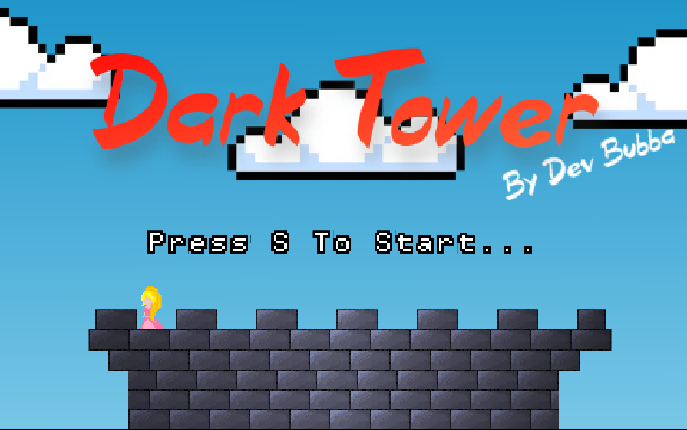
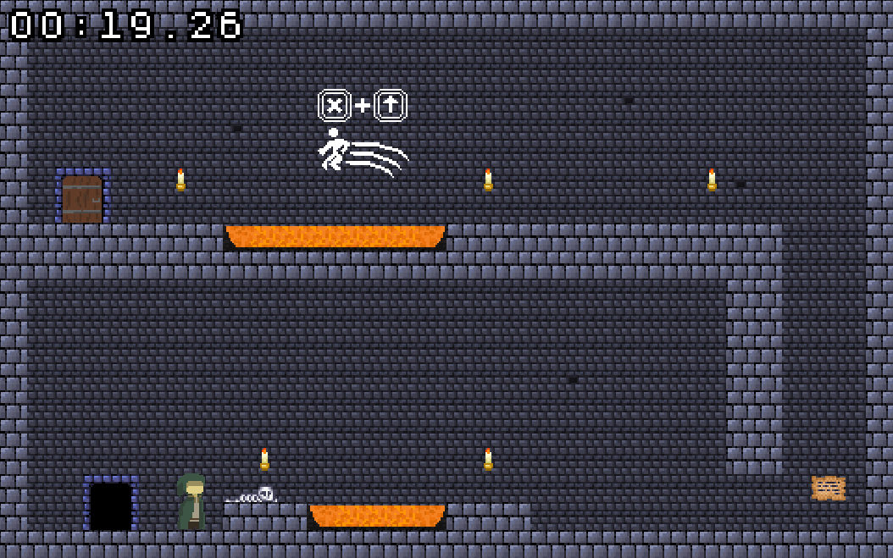
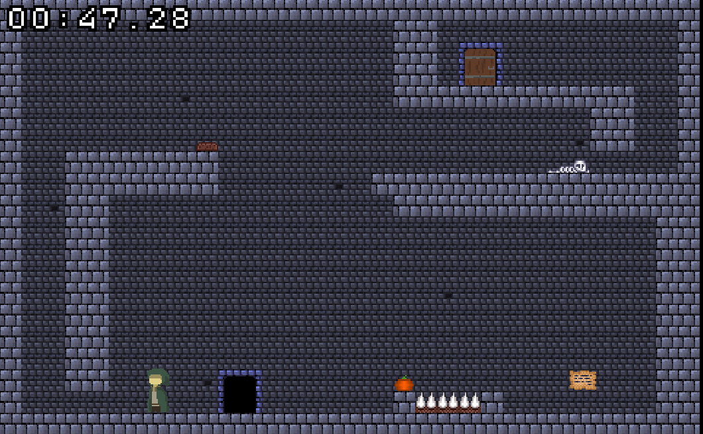
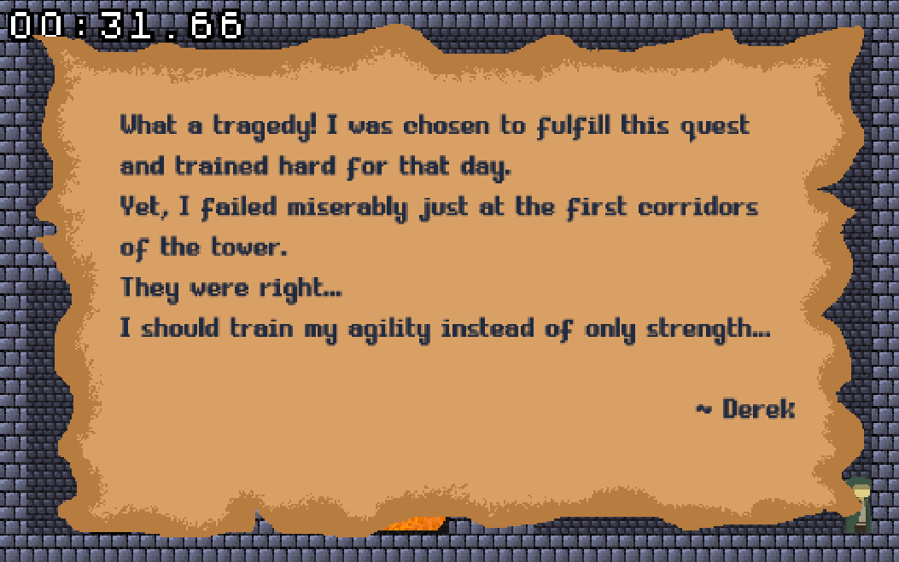

  

    
    
     
     
    
     
    <a href="https://Dark-Tower.devbubba.repl.co">Play Dark Tower</a>

# 🎮 Dark Tower

### The Princess is at the Top of the Tower. You Need to Get There as Fast as You Can and Try to Save Her! Try to Beat Your Best Time and Get the Fastest Time You Can. The World Record Run is 33.96 Seconds Set by Quinton Hall! Can You Beat It? Find Out by Playing the Game for Yourself!

# ⌨️ Leyboard Shorcuts

| Description                                                | Keys                                                                 |
| ---------------------------------------------------------- | -------------------------------------------------------------------- |
| Skip To End Of Game Credits Easter Egg                     | <kbd>Shift</kbd>-<kbd>}</kbd>                                        |
| Skip To End Of Game Easter Egg                             | <kbd>Shift</kbd>-<kbd>{</kbd>                                        |
| Restart Game                                               | <kbd>R</kbd>                                                         |
| Skip Scene                                                 | <kbd>Space</kbd>                                                     |
| Open Note                                                  | <kbd>Space</kbd> or <kbd>z</kbd>                                     |
| Main Menu                                                  | <kbd>Q</kbd>                                                         |

# 📷 Preview

  

  

  

# 🧾 License

### Dark Tower is licensed under the <a href="https://mit-license.org/.">MIT License</a>

